# Entity Relationship Diagram

This document contains the Entity Relationship Diagram (ERD) for the **Academic Lifestyle Risk Analyzer**.
The diagram follows the Chen notation style as requested:
- **Rectangles**: Entities
- **Ovals**: Attributes (PK = Primary Key, FK = Foreign Key)
- **Diamonds**: Relationships

```mermaid
flowchart TD
    %% Global Styles
    classDef entity fill:#e1f5fe,stroke:#01579b,stroke-width:2px,color:#000,rx:5,ry:5;
    classDef attribute fill:#fff,stroke:#333,stroke-width:1px,color:#000;
    classDef pk fill:#fff9c4,stroke:#fbc02d,stroke-width:2px,color:#000;
    classDef fk fill:#e0f2f1,stroke:#00695c,stroke-width:1px,stroke-dasharray: 5 5,color:#000;
    classDef relationship fill:#fce4ec,stroke:#880e4f,stroke-width:2px,shape:diamond,color:#000;

    %% 1. User Entity
    User[User]:::entity
    subgraph UserAttributes [User Attributes]
        direction TB
        UserId((user_id)):::pk
        Name((name)):::attribute
        Email((email)):::attribute
        Password((password)):::attribute
        Role((role)):::attribute
        CreatedAt((created_at)):::attribute
    end
    User --- UserId
    User --- Name
    User --- Email
    User --- Password
    User --- Role
    User --- CreatedAt

    %% 2. Profile Entity
    Profile[Profile]:::entity
    subgraph ProfileAttributes [Profile Attributes]
        direction TB
        ProfileId((profile_id)):::pk
        P_UserId((user_id)):::fk
        Department((department)):::attribute
        P_Year((year)):::attribute
        P_Semester((semester)):::attribute
        P_Attendance((attendance)):::attribute
        StudyGoal((study_goal)):::attribute
    end
    Profile --- ProfileId
    Profile --- P_UserId
    Profile --- Department
    Profile --- P_Year
    Profile --- P_Semester
    Profile --- P_Attendance
    Profile --- StudyGoal

    %% Relationship: User (1) -- (1) Profile
    User -- 1 --> Rel_UserProfile{Has}:::relationship
    Rel_UserProfile -- 1 --> Profile

    %% 3. Risk_Analysis Entity
    RiskAnalysis[Risk_Analysis]:::entity
    subgraph RiskAttributes [Risk Attributes]
        direction TB
        AnalysisId((analysis_id)):::pk
        RA_UserId((user_id)):::fk
        StudyHours((study_hours)):::attribute
        SleepHours((sleep_hours)):::attribute
        RA_Attendance((attendance)):::attribute
        StressLevel((stress_level)):::attribute
        RiskScore((risk_score)):::attribute
        RiskLevel((risk_level)):::attribute
        RA_CreatedAt((created_at)):::attribute
    end
    RiskAnalysis --- AnalysisId
    RiskAnalysis --- RA_UserId
    RiskAnalysis --- StudyHours
    RiskAnalysis --- SleepHours
    RiskAnalysis --- RA_Attendance
    RiskAnalysis --- StressLevel
    RiskAnalysis --- RiskScore
    RiskAnalysis --- RiskLevel
    RiskAnalysis --- RA_CreatedAt

    %% Relationship: User (1) -- (N) Risk_Analysis
    User -- 1 --> Rel_UserRisk{Triggers}:::relationship
    Rel_UserRisk -- N --> RiskAnalysis

    %% 4. Dashboard Entity
    Dashboard[Dashboard]:::entity
    subgraph DashboardAttributes [Dashboard Attributes]
        direction TB
        DashboardId((dashboard_id)):::pk
        D_UserId((user_id)):::fk
        LatestRiskScore((latest_risk_score)):::attribute
        CurrentCGPA((current_cgpa)):::attribute
        TargetCGPA((target_cgpa)):::attribute
        RequiredGPA((required_gpa)):::attribute
        LastUpdated((last_updated)):::attribute
    end
    Dashboard --- DashboardId
    Dashboard --- D_UserId
    Dashboard --- LatestRiskScore
    Dashboard --- CurrentCGPA
    Dashboard --- TargetCGPA
    Dashboard --- RequiredGPA
    Dashboard --- LastUpdated

    %% Relationship: User (1) -- (1) Dashboard
    User -- 1 --> Rel_UserDash{Owns}:::relationship
    Rel_UserDash -- 1 --> Dashboard

    %% 5. Reports Entity
    Reports[Reports]:::entity
    subgraph ReportsAttributes [Reports Attributes]
        direction TB
        ReportId((report_id)):::pk
        R_UserId((user_id)):::fk
        AvgStudyHours((average_study_hours)):::attribute
        AvgSleepHours((average_sleep_hours)):::attribute
        AvgAttendance((average_attendance)):::attribute
        RiskTrend((risk_trend)):::attribute
        GeneratedAt((generated_at)):::attribute
    end
    Reports --- ReportId
    Reports --- R_UserId
    Reports --- AvgStudyHours
    Reports --- AvgSleepHours
    Reports --- AvgAttendance
    Reports --- RiskTrend
    Reports --- GeneratedAt

    %% Relationship: User (1) -- (N) Reports
    User -- 1 --> Rel_UserReports{Generates}:::relationship
    Rel_UserReports -- N --> Reports

    %% 6. CGPA_Goal Entity
    CGPAGoal[CGPA_Goal]:::entity
    subgraph CGPAAttributes [CGPA Attributes]
        direction TB
        GoalId((goal_id)):::pk
        C_UserId((user_id)):::fk
        C_CurrentCGPA((current_cgpa)):::attribute
        C_TargetCGPA((target_cgpa)):::attribute
        C_RequiredGPA((required_gpa)):::attribute
        SemesterCount((semester_count)):::attribute
    end
    CGPAGoal --- GoalId
    CGPAGoal --- C_UserId
    CGPAGoal --- C_CurrentCGPA
    CGPAGoal --- C_TargetCGPA
    CGPAGoal --- C_RequiredGPA
    CGPAGoal --- SemesterCount

    %% Relationship: User (1) -- (1) CGPA_Goal
    User -- 1 --> Rel_UserCGPA{Sets}:::relationship
    Rel_UserCGPA -- 1 --> CGPAGoal

    %% 7. Recommendations Entity
    Recommendations[Recommendations]:::entity
    subgraph RecAttributes [Recommendation Attributes]
        direction TB
        RecId((recommendation_id)):::pk
        R_AnalysisId((analysis_id)):::fk
        Message((message)):::attribute
        PriorityLevel((priority_level)):::attribute
    end
    Recommendations --- RecId
    Recommendations --- R_AnalysisId
    Recommendations --- Message
    Recommendations --- PriorityLevel

    %% Relationship: Risk_Analysis (1) -- (N) Recommendations
    RiskAnalysis -- 1 --> Rel_RiskRec{Provides}:::relationship
    Rel_RiskRec -- N --> Recommendations

```

